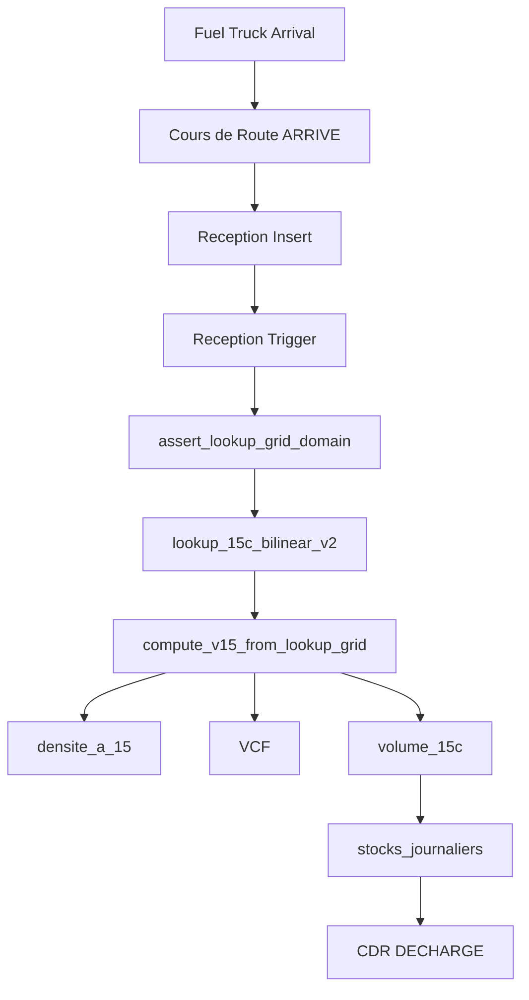

# Volumetric Engine Architecture

**Document** : Architectural description of the ASTM volumetric engine runtime pipeline.  
**Project** : ML_PP MVP  
**Purpose** : Help developers understand how the ASTM volumetric engine works inside the system.

---

## 1. System overview

ML_PP MVP is a petroleum logistics system. The application manages:

- supplier transports
- fuel receptions
- fuel deliveries
- tank stock
- volumetric calculations

The system follows the physical pipeline:

**Supplier**  
→ **Truck transport**  
→ **Cours de Route**  
→ **Depot reception**  
→ **Tank stock**  
→ **Customer delivery**

Critical business logic runs in PostgreSQL. Volumetric calculations are executed entirely in the database.

---

## 2. Engine architecture

### Volumetric requirement

The system must compute **standardized fuel volumes at 15°C**, following **API MPMS 11.1**. The engine converts observed field measurements into standard volumes.

**Inputs:**

- volume_observe
- temperature
- densite_observee

**Outputs:**

- densite_a_15
- VCF
- volume_15c

### Implementation

The volumetric engine runs entirely inside PostgreSQL.

**Main runtime functions:**

- `astm.compute_v15_from_lookup_grid`
- `astm.lookup_15c_bilinear_v2`
- `astm.assert_lookup_grid_domain`

**Interpolation method:** bilinear interpolation over the lookup grid dataset.

---

## 3. Runtime pipeline

### Reception pipeline

1. **cours_de_route** status = ARRIVE  
2. → reception insert  
3. → trigger execution  
4. → volumetric calculation  
5. → stock update  
6. → CDR status = DECHARGE

### Delivery pipeline (sortie)

1. **sorties_produit** insert  
2. → trigger execution  
3. → volumetric calculation  
4. → stock update  

**Trigger:** `trg_02_sorties_compute_lookup_15c`

---

## 4. Lookup grid dataset

**Table:** `public.astm_lookup_grid_15c`

**Characteristics:**

- 63 points
- 9 density levels
- 7 temperature levels

**Domain:**

- density: 820 → 860 kg/m³
- temperature: 10 → 40 °C

The engine uses this dataset for bilinear interpolation. Inputs outside the domain are rejected by the domain guard.

---

## 5. Trigger execution

### Reception trigger

**Trigger:** `trg_receptions_compute_15c_before_ins`

**Pipeline executed by the trigger:**

1. volume_ambiant (input)
2. → domain guard (`astm.assert_lookup_grid_domain`)
3. → lookup grid interpolation (`astm.lookup_15c_bilinear_v2`)
4. → densite_a_15 calculation
5. → VCF calculation
6. → volume_15c calculation

### Sortie trigger

**Trigger:** `trg_02_sorties_compute_lookup_15c`

Same volumetric engine path: domain guard → interpolation → densite_a_15, VCF, volume_15c.

---

## 6. Lookup grid engine algorithm

1. Validate input domain (reject out-of-domain inputs).
2. Identify surrounding grid nodes.
3. Perform bilinear interpolation.
4. Compute densite_a_15.
5. Compute VCF.
6. Compute volume_15c.

---

## 7. System guarantees

The architecture ensures:

- **Deterministic volumetric calculations** — Same inputs yield the same outputs.
- **Database-driven business logic** — All volumetric computation runs in PostgreSQL.
- **No volumetric computation in the frontend** — The application supplies inputs and reads results only.
- **Environment-independent results** — The same engine runs in STAGING and PRODUCTION.

---

## 8. Diagram

---

## 9. Environment note

Both **STAGING** and **PRODUCTION** now run the same volumetric runtime engine.

The following elements are identical:

- runtime functions
- runtime triggers
- lookup grid dataset
- volumetric engine behavior

This guarantees identical volumetric calculations across environments.
